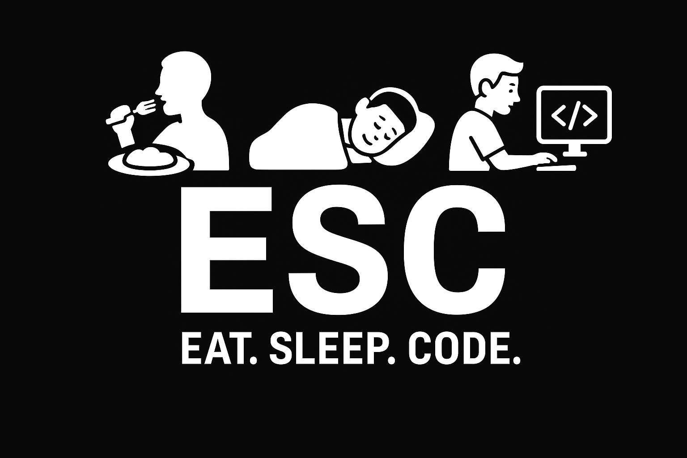

<h1 align="center">🎟️ ESC</h1>

  

# 🔗 접속 주소
[4WeekDays](https://www.fourweeeek.kro.kr/)

### 관리자 계정
ID: admin@warehouse.com

PASSWORD: qwer1234

# 👨‍💻 팀원 구성

  <table>
    <tr>
      <td align="center">
        
         <b>양형모</b>
      </td>
      <td align="center">
        
         <b>강설</b>
      </td>
      <td align="center">
        
         <b>김원중</b>
      </td>
      <td align="center">
        
         <b>이현식</b>
      </td>
    </tr>
  </table>

# 📌 4WeekDays - 프로젝트 개요

## 1. 📝 프로젝트 설명
FourWeekdays는 기업 물류 전 과정을 디지털화한 ERP형 통합 창고관리 시스템(WMS)입니다.

공급업체로부터의 상품 입고부터 출고, 재고, 작업까지 모든 물류 데이터를 단일 플랫폼에서 통합 관리할 수 있도록 설계되었습니다.

실시간 데이터 연동을 통해 재고 정확도를 높이고, 업무 표준화 및 운영 효율성 극대화를 목표로합니다.
> 공급업체로부터 상품을 입고받아 관리하는 입출고·재고·작업 관리를 통합하는 창고관리 시스템

👥 대상 사용자
- 관리자(Admin): 전체 시스템 관리 및 승인 업무
- 매니저(Manager): 발주 관리, 입고 계획, 작업 배정
- 작업자(Worker): 검수, 적치 등 현장 작업 수행
- 공급업체(Vendor): ASN 전송, 납품 정보 제공
- 출고처(Franchise): 창고로 주문 발송

## 2. 🏪 배경 및 현황
### 🏪 현황
- 공급망 복잡도 증가: 다양한 공급업체로부터 동시다발적인 입고 발생
- 입고 처리 효율성 요구: 제한된 인력으로 대량의 입고 물량 처리 필요
- 실시간 재고 가시성: 입고 중인 상품과 보관 중인 재고의 실시간 추적 필요
- 작업 배정 필요성: 검수·적치 및 진행 상황 모니터링

### 💥 기존 창고관리의 한계
- 입고 지연 및 로케이션 혼잡: 공급업체별 납품 일정 불일치로 입고 대기 및 적치 지연 발생
- 재고 가시성 부족: 입고 진행 중인 상품의 실시간 상태 파악 어려움
- 데이터 활용성 저하: 입고·재고 데이터가 단순 집계에만 활용되어 의사결정 지원 부족
- 공급업체 협업 한계: 입고 예정 정보를 사전에 파악하기 어려워 사전 준비 불가

### ✅ 목표
- ASN 기반 입고 자동화: 공급업체가 전송한 ASN을 기반으로 입고 예정 정보 자동 등록 및 검수 작업 생성
- 작업 배정 시스템: 작업자 배정을 시스템 상에서 파악하고 배정
- 로케이션 최적화: 공급업체별, 상품 특성별 적치 위치 추천
- 실시간 입고 현황 모니터링: 입고 진행률, 검수 상태, 적치 완료율 대시보드 제공
- 데이터 기반 의사결정: 공급업체별 납품 실적, 작업자별 처리 효율 분석
- 부분입고 지원: 발주 수량과 실제 입고 수량이 다를 수 있는 분할 입고 자동 처리

# ✨ 주요 기능
## 📦 공급업체 관리
- 공급업체 등록 및 정보 관리
- 공급업체별 상품 매핑
- 공급업체별 전용 로케이션 할당

## 📋 발주 관리 (Purchase Order)
- 발주서 생성, 수정, 승인
- 발주 상품 목록 관리
- 발주 상태 관리 (발주 요청 → 승인 완료 → 납품 대기 → 배송 완료 → 취소)
- 발주 진행률 조회 (입고 완료율)

## 📨 ASN (사전 입고 통지) 관리
- 공급업체 ASN 수신: 발주서에 대한 공급 업체의 ASN 수신
- ASN 기반 입고서 자동 생성: ASN 수신 시 입고 예정 정보 자동 등록
- ASN 내역 조회 및 추적
## ASN 프로세스
- 발주서 작성 -> 발주 승인 → 공급업체 ASN 수신 → 입고서 자동 생성 → 검수 작업 생성

## 📥 입고 관리 (Inbound)
- 입고 예정 관리: ASN 기반 입고 예정 정보 자동 등록
- 입고 진행 상태 관리: 예정 → 검수 중 → 적치 중 → 완료
- 입고 상품 관리: 상품별 예상 수량, 실제 검수 수량, LOT 번호 관리
- 입고 이력 조회 및 추적

## ✅ 작업(Task) 관리
### 검수 작업(Inspection Task)
- 입고서 생성 시 자동으로 검수 작업 생성
- 작업자 배정
- 검수 진행 및 완료 처리
- 상품별 실제 수량 기록

### 적치 작업(Putaway Task)
- 검수 완료 시 자동으로 적치 작업 생성
- 로케이션 자동 추천 또는 수동 지정
- 작업자 배정
- 적치 완료 처리 및 재고 반영
- 작업자별 작업 현황 조회

## 📍 로케이션 관리
- 로케이션 등록 및 정보 관리
- 공급업체별 전용 로케이션 지정
- 로케이션별 용량 관리
- 로케이션 사용률 조회

## 📦 재고 관리 (Inventory)
- 공급업체별 재고 현황: 공급업체별로 재고 수량 조회
- 로케이션별 재고 현황: 어느 위치에 무엇이 있는지 실시간 조회
- LOT 번호 기반 추적: 입고 시점의 LOT 번호로 재고 이력 추적
- 입고 완료 시 재고 자동 증가: 적치 완료 시점에 재고 자동 반영
- 재고 검색 및 필터링

## 🔍 검색 기능
- 상품/재고/입고/발주 내역 통합 검색 지원
- 다양한 필터 제공 (공급업체, 상품, 재고 수량, 입고 상태, 날짜 등)
- 정렬 옵션 (최신 입고 순, 재고 부족 우선 등)

## 📊 데이터 시각화 및 알림

# 🛠️ 기술 스택

## Backend

## Frontend

## Database

## Infrastructure

## Tools

# 🏗️ 시스템 아키텍처
<table align="center">
  

# 📚 문서
- [📖 Wiki 바로가기](https://github.com/beyond-sw-camp/be17-fin-ESC-4Weekdays-FE/wiki)
- [프로젝트 기획서](https://github.com/beyond-sw-camp/be17-fin-ESC-4Weekdays-FE/wiki/Team-ESC-%E2%80%90-4WeekDays-%ED%94%84%EB%A1%9C%EC%A0%9D%ED%8A%B8-%EA%B8%B0%ED%9A%8D%EC%84%9C)
- [WBS](https://github.com/beyond-sw-camp/be17-fin-ESC-4Weekdays-FE/wiki/WBS)
- [ERD](https://github.com/beyond-sw-camp/be17-fin-ESC-4Weekdays-FE/wiki/ERD)
- [요구사항 정의서](https://github.com/beyond-sw-camp/be17-fin-ESC-4Weekdays-FE/wiki/%EC%9A%94%EA%B5%AC%EC%82%AC%ED%95%AD-%EB%AA%85%EC%84%B8%EC%84%9C)
- [시스템 아키텍쳐](https://github.com/beyond-sw-camp/be17-fin-ESC-4Weekdays-FE/wiki/%EC%8B%9C%EC%8A%A4%ED%85%9C-%EC%95%84%ED%82%A4%ED%85%8D%EC%B2%98)
- [피그마 링크](https://github.com/beyond-sw-camp/be17-fin-ESC-4Weekdays-FE/wiki/%ED%99%94%EB%A9%B4-%EC%84%A4%EA%B3%84%EC%84%9C-%ED%94%BC%EA%B7%B8%EB%A7%88-%EB%A7%81%ED%81%AC)
- [스웨거 단위 테스트](https://github.com/beyond-sw-camp/be17-fin-ESC-4Weekdays-FE/wiki/Swagger-API-%EB%8B%A8%EC%9C%84-%ED%85%8C%EC%8A%A4%ED%8A%B8)
- [UI/UX 화면 테스트](https://github.com/beyond-sw-camp/be17-fin-ESC-4Weekdays-FE/wiki/UI-UX-%ED%99%94%EB%A9%B4-%ED%85%8C%EC%8A%A4%ED%8A%B8-%EA%B2%B0%EA%B3%BC%EC%84%9C)
- [Team ESC - Github 가이드](https://github.com/beyond-sw-camp/be17-fin-ESC-4Weekdays-FE/wiki/Team-ESC-%E2%80%90-Git-Branch-%EC%A0%84%EB%9E%B5-%EB%B0%8F-%EC%BB%A8%EB%B2%A4%EC%85%98-%EA%B0%80%EC%9D%B4%EB%93%9C)
- [Jenkins를 통한 CI/CD 파이프라인 구축](https://github.com/beyond-sw-camp/be17-fin-ESC-4Weekdays-FE/wiki/Jenkins%EB%A5%BC-%ED%86%B5%ED%95%9C-CI-CD-%ED%8C%8C%EC%9D%B4%ED%94%84%EB%9D%BC%EC%9D%B8-%EA%B5%AC%EC%B6%95%ED%95%98%EA%B8%B0)
- [2차 스프린트 기획](https://github.com/beyond-sw-camp/be17-fin-ESC-4Weekdays-FE/wiki/2%EC%B0%A8-%EC%8A%A4%ED%94%84%EB%A6%B0%ED%8A%B8-%EA%B3%84%ED%9A%8D)